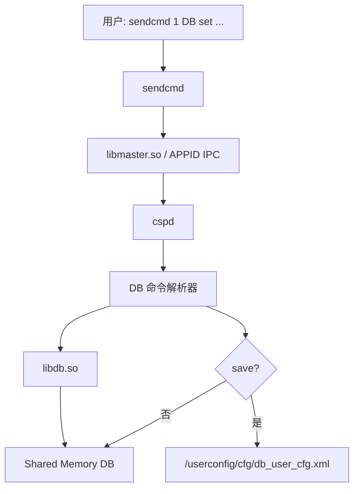
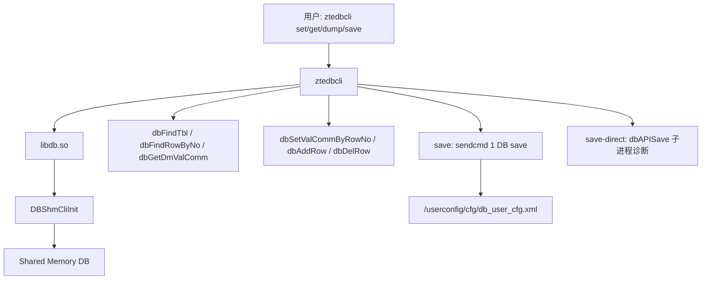

# ztedbcli

`ztedbcli` 是面向 ZTE Buildroot 光猫/ONT 的运行时配置数据库 CLI。

它直接调用设备上的 `libdb.so` shared memory client API，读取和修改 `cspd` 已经加载到共享内存里的运行时 DB。它可以作为 `sendcmd 1 DB ...`的一部分替代方案，尤其适合 `sendcmd` 被裁剪、输出脱敏、或者需要批量导出 运行时表值的场景。

它不是离线解密工具，不解析 `/userconfig/cfg/db_user_cfg.xml`。

> 基于 \`ZTE G7615 v1\` 分析，可能和其他设备存在兼容问题，具体可以自行编译。

## 能做什么

| 功能 | 命令 |
| --- | --- |
| 显示帮助 | `ztedbcli` 或 `ztedbcli help` |
| 打印单表 | `ztedbcli TelnetCfg` 或 `ztedbcli p TelnetCfg` |
| 批量导出内置表清单 | `ztedbcli dump -o runtime-db.xml` |
| 按外部清单导出 | `ztedbcli dump -f db-table-list.txt -o runtime-db.xml` |
| 读取字段 | `ztedbcli get TelnetCfg 0 Lan_Enable` |
| 修改字段 | `ztedbcli set TelnetCfg 0 Lan_Enable 1` |
| 添加行 | `ztedbcli addrow WLANCfg` |
| 删除行 | `ztedbcli delrow WLANCfg 3` |
| 保存到用户配置包 | `ztedbcli save` |
| 诊断直接保存 | `ztedbcli save-direct` |
| 诊断动态库和 DB 初始化 | `ztedbcli diag` |

内置表清单来自当前 G7615 样本的运行时 dump 和解密后的 `db_user_cfg.xml`： 原运行时清单 194 张表，另补入 `db_user_cfg.xml` 中存在但 runtime dump 未覆盖的 217 张表，当前合计 412 个表名。其它机型建议用 `dump -f` 提供自己的表名清单。 项目根目录同时提供 [db-table-list.txt](db-table-list.txt)，内容与代码内置清单一致， 已去重。

## 快速编译

需要 ARM 交叉编译器，以及目标设备 rootfs 里的 ARM 版动态库：

```text
libdb.so
liboss.so
libcommfun.so
libcfapi.so
libifscfapi.so
libdbcspview.so
```

其中 `libdbcspview.so` 是 `libdb.so` 在 `DBShmCliInit` 阶段通过 `dlopen`动态加载的运行时 view 插件。`libdbcspview.so` 又需要 `libcfapi.so` 提供 `CfGetWlanNum`，`libcfapi.so` 又需要 `libifscfapi.so` 提供 `GetRouteIFInfo`。 裸跑时必须让动态加载器能找到这些库。

如果这些库已经放在项目的 `lib/` 目录，直接：

```sh
CC=arm-buildroot-linux-gnueabi-gcc ./build.sh
```

如果有对应静态库 `libdb.a/liboss.a/libcommfun.a`，可以把原厂库静态进 程序，避免目标系统升级后删掉或改名这些 `.so`：

```sh
STATIC=1 CC=arm-buildroot-linux-gnueabi-gcc ./build.sh
```

如果还想尝试全静态并用 UPX 压缩：

```sh
STATIC=1 FULL_STATIC=1 UPX=1 CC=arm-buildroot-linux-gnueabi-gcc ./build.sh
```

注意：只有 `.so` 时不能做真正静态链接，必须有对应 `.a`。

如果暂时只有 `.so`，但希望设备上不依赖系统自带的 `libdb.so` 等库，可以把 原厂库随程序打包成 bundle：

```sh
BUNDLE=1 UPX=1 CC=arm-buildroot-linux-gnueabi-gcc ./build.sh
```

生成的 `ztedbcli.bundle.tgz` 内含 `ztedbcli`、`lib/` 和 `run.sh`。

如果库在提取出来的 rootfs 中：

```sh
CC=arm-buildroot-linux-gnueabi-gcc \
ROOTFS=/path/to/rootfs \
./build.sh
```

或者只指定库目录：

```sh
CC=arm-buildroot-linux-gnueabi-gcc \
LIBDIR=/path/to/rootfs/lib \
./build.sh
```

输出文件默认是：

```text
./ztedbcli
```

## 设备端运行

上传到设备，例如 `/tmp/ztedbcli`：

```sh
# 其中 `/opt/cu/apps/apps/root/lib` 表示启动时从该目录加载lib依赖so文件
# 默认情况下 系统自带这些lib，启动时候直接执行./ztedbcli即可
chmod +x /tmp/ztedbcli
LD_LIBRARY_PATH=/opt/cu/apps/apps/root/lib:/lib:/usr/lib /tmp/ztedbcli TelnetCfg
```

常用示例：

```sh
LD_LIBRARY_PATH=/lib:/usr/lib /tmp/ztedbcli diag
LD_LIBRARY_PATH=/lib:/usr/lib /tmp/ztedbcli p TelnetCfg
LD_LIBRARY_PATH=/lib:/usr/lib /tmp/ztedbcli get TelnetCfg 0 Lan_Enable
LD_LIBRARY_PATH=/lib:/usr/lib /tmp/ztedbcli get DevAuthInfo 0 Pass
LD_LIBRARY_PATH=/lib:/usr/lib /tmp/ztedbcli set DevAuthInfo 0 Pass new_password
LD_LIBRARY_PATH=/lib:/usr/lib /tmp/ztedbcli set TelnetCfg 0 Lan_Enable 1
LD_LIBRARY_PATH=/lib:/usr/lib /tmp/ztedbcli save
LD_LIBRARY_PATH=/lib:/usr/lib /tmp/ztedbcli dump -o /tmp/runtime-db.xml
```

如果看到 `Open libdbcspview.so failed`，说明 `LD_LIBRARY_PATH` 没包含 `libdbcspview.so` 所在目录。优先使用 bundle 的 `run.sh`，或把它加入：

```sh
LD_LIBRARY_PATH=/opt/cu/apps/apps/root/lib:/lib:/usr/lib \
  /opt/cu/apps/apps/root/ztedbcli diag
```

`diag` 会先主动 `dlopen` 检查 `libifscfapi.so`、`libcfapi.so`、 `libdbcspview.so`，再检查 `shmget(0xffff, 0, 0)` 和固定地址 `shmat`， 然后才调用一次 `DBShmCliInit()`，最后测试 `dbFindTbl("TelnetCfg")`。

当前 G7615 样本中，`DBShmCliInit()` 可能返回 `1610616996`，即 `0x600010a4`。由于公开的 `printbl.c` 示例也不检查这个返回值，实际判断应 以后续 `dbFindTbl()` 是否成功为准。`ztedbcli` 会把这个值作为 warning 打印，并继续访问运行时表。

写入语义和 `sendcmd 1 DB set/save` 一样：

- `set/addrow/delrow` 只修改共享内存中的运行时 DB。
- `save` 才会触发持久化保存；默认通过 `sendcmd 1 DB save` 进入原厂保存路径。
- `save-direct` 会在子进程里尝试直接调用 `dbAPISave()`，只用于诊断。当前 G7615 固件中，独立进程直接 `dbAPISave()` 可能段错误。
- 不执行 `save` 就重启，修改通常会丢失。

## 调用链概览

`sendcmd` 路径：



`ztedbcli` 路径：



## 文档索引

更完整的设计、使用和验证说明见：

| 文档 | 内容 |
| --- | --- |
| 架构与调用链 | `sendcmd`、`cspd`、`libdb.so`、shared memory 和 `ztedbcli` 的调用关系。 |
| 命令参考 | `diag`、`dump`、`get`、`set`、`addrow`、`delrow`、`save` 等命令用法。 |
| 编译与部署 | 交叉编译、动态库依赖、bundle、UPX、常见链接和运行错误处理。 |
| 限制与验证 | 已知限制、只读/写入验证流程、与离线 `dbunpack/dbpack` 的关系。 |

## 风险提示

`ztedbcli` 直接操作运行时 DB。修改前建议先 `get` 或 `dump` 备份目标表； 修改后确认运行状态正常，再执行 `save`。不同固件中的内部结构体布局可能变化， 移植到其它机型时需要重新验证。