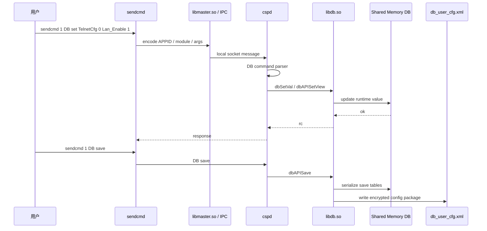
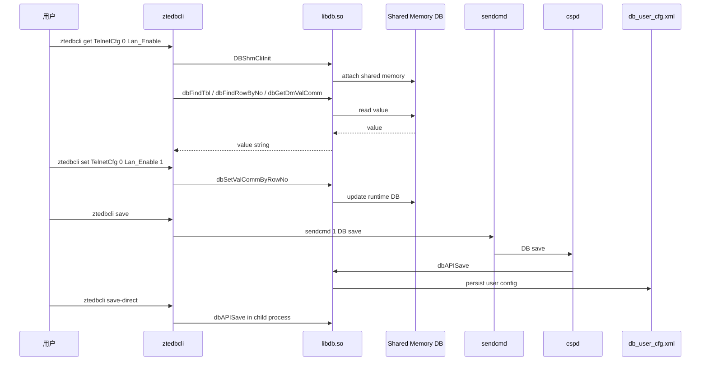
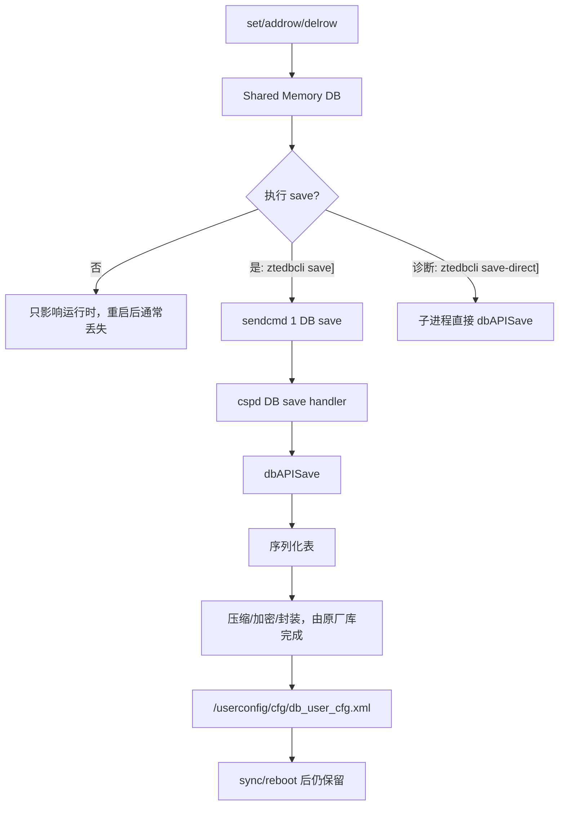

# 架构与调用链

本文说明 ZTE 配置数据库运行时链路，以及 `ztedbcli` 为什么可以绕过 `sendcmd` 直接访问共享内存 DB。

## 背景模型

ZTE Buildroot 光猫中的配置通常不是 Web 或命令直接改 XML 文件。常见链路是：

```text
Web / TR-069 / DBus / sendcmd
  -> 业务进程，当前样本主要是 cspd
  -> libdb.so
  -> Shared Memory DB
  -> save 后持久化为 db_user_cfg.xml
```

`db_user_cfg.xml` 是持久化配置包，不是运行时数据库本体。设备启动后， `cspd` 将默认配置、用户配置或备份配置加载到共享内存；之后 Web、TR-069、 DBus、`sendcmd` 读写的主要是这份运行时 DB。

## sendcmd 调用逻辑

`sendcmd` 是 DB Client，但它不直接链接 `libdb.so` 去读表。它通过 ZTE 的 APPID IPC 框架把命令发给目标业务进程。



因此 `sendcmd` 的特点是：

- 依赖 APPID IPC 和目标业务进程的命令处理器。
- 命令是否存在取决于固件是否保留对应调试入口。
- 打印路径可能对敏感字段脱敏。
- 本身不解析 `db_user_cfg.xml`。

## ztedbcli 调用逻辑

`ztedbcli` 走另一条路：直接作为 `libdb.so` 的 shared memory client。



这个路径的特点：

- 读表、读字段、写字段不依赖 `sendcmd` 是否存在。
- 默认 `save` 仍通过 `sendcmd 1 DB save` 进入原厂保存路径。
- `save-direct` 仅用于诊断直接 `dbAPISave()`，当前 G7615 固件中可能段错误。
- 读表、读字段、写字段不依赖 APPID IPC 命令表；默认保存仍依赖原厂 `sendcmd`/`cspd` 保存入口。
- 必须在 `cspd` 已经运行并创建共享内存后执行。
- 必须和 `cspd` 位于可访问同一 shared memory 的运行环境。
- 依赖 `libdb.so` 内部结构体布局，跨机型需要验证。

## 两条路径对比

| 项目 | sendcmd | ztedbcli |
| --- | --- | --- |
| 入口 | APPID IPC 调试命令 | `libdb.so` shared memory client |
| 目标进程 | `cspd` 等业务进程 | 本进程直接 attach shared memory |
| 读表 | `sendcmd 1 DB p Table` | `ztedbcli p Table` |
| 读字段 | 依固件命令而定 | `ztedbcli get Table Row DM` |
| 写字段 | `sendcmd 1 DB set ...` | `ztedbcli set ...` |
| 保存 | `sendcmd 1 DB save` | `ztedbcli save` |
| 是否读 XML | 否 | 否 |
| 是否可能脱敏 | 打印路径可能脱敏 | 取决于 `dbGet*` API 返回值 |
| 被裁剪风险 | 高 | 读写只要库和符号还在即可；默认保存仍依赖 `sendcmd` |

## 保存生命周期



`ztedbcli` 不自己实现配置文件加密和重打包；保存时仍调用设备原厂 `sendcmd` / `cspd` / `libdb.so` 相关路径完成持久化。当前 G7615 上，独立 进程直接调用 `dbAPISave()` 可能段错误，因此只保留为 `save-direct` 诊断入口。