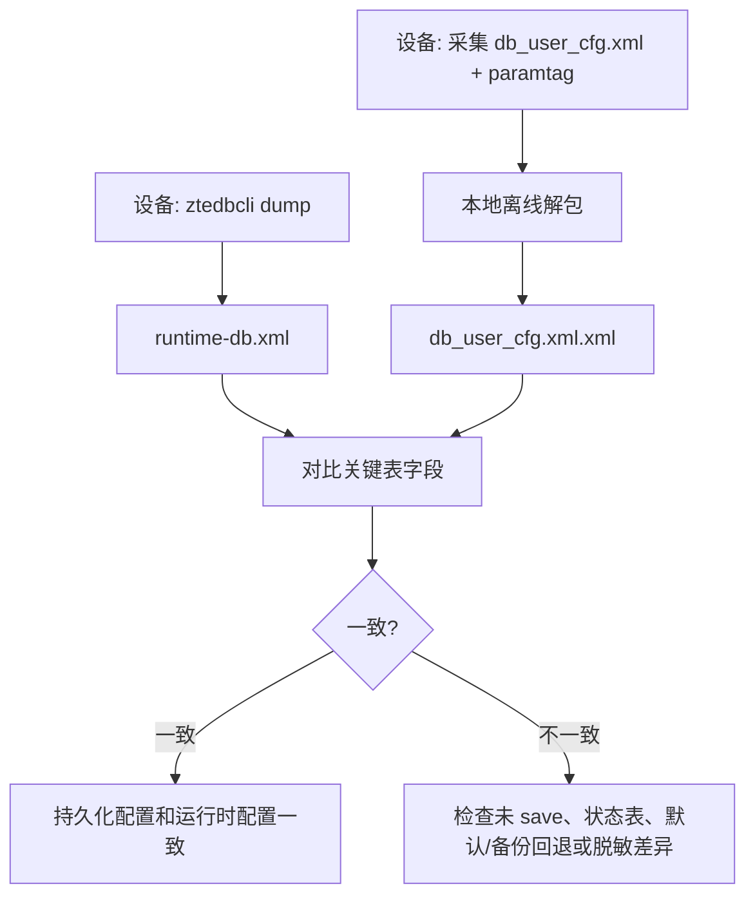

# 限制与验证

## 明确不做的事

`ztedbcli` 不做以下事情：

- 不解密 `db_user_cfg.xml`。
- 不解析离线配置包(U盘备份)。
- 不重打包配置文件。
- 不绕过 `libdb.so` 的字段类型转换。
- 不保证跨所有 ZTE 机型结构体布局一致。

它只是一个运行时 DB client。

## 已实现能力

| 能力 | 状态 |
| --- | --- |
| `DBShmCliInit` 连接共享内存 | 已实现 |
| `dbFindTbl` 查表 | 已实现 |
| 遍历行/列并 XML 输出 | 已实现 |
| 内置 G7615 表清单批量 dump | 已实现 |
| 外部表清单批量 dump | 已实现 |
| `get` 读取单字段 | 已实现 |
| `set` 修改单字段 | 已实现 |
| `addrow` 添加行 | 已实现 |
| `delrow` 删除行 | 已实现 |
| `save` 调用 `dbAPISave` | 已实现 |

## 需要实机验证的点

不同固件需要验证：

- `tbl_t`、`tbl_row_t`、`tbl_col_t` 内部布局是否一致。
- `dbGetDmValComm` 对敏感字段是否返回真实值。
- `dbAPISave` 是否同步写盘，还是只触发异步保存。
- `addrow/delrow` 是否需要业务层额外刷新。
- 表名清单是否适用于当前型号。

## 推荐验证流程

只读验证：

```sh
LD_LIBRARY_PATH=/lib:/usr/lib /tmp/ztedbcli p TelnetCfg
LD_LIBRARY_PATH=/lib:/usr/lib /tmp/ztedbcli get TelnetCfg 0 Lan_Enable
```

对照 `sendcmd`：

```sh
sendcmd 1 DB p TelnetCfg
/tmp/ztedbcli p TelnetCfg
```

批量 dump：

```sh
/tmp/ztedbcli dump -o /tmp/runtime-db.xml
```

写入验证建议选择可恢复、低风险字段：

```sh
OLD=$(/tmp/ztedbcli get TelnetCfg 0 Lan_Enable)
/tmp/ztedbcli set TelnetCfg 0 Lan_Enable "$OLD"
/tmp/ztedbcli get TelnetCfg 0 Lan_Enable
```

确认无误后再测试实际修改和 `save`。

## 风险说明

`set/addrow/delrow/save` 都可能影响设备配置。建议：

- 先导出 `/userconfig/cfg/db_user_cfg.xml`、`db_backup_cfg.xml` 和 `/tagparam/paramtag`。
- 先 dump 目标表。
- 不要对不理解的表执行 `addrow/delrow`。
- 保存后执行 `sync`。
- 关键设备上先准备串口、恢复方式或完整配置备份。

## 和离线工具的关系

离线工具负责分析持久化文件：

```text
db_user_cfg.xml -> 解密 -> 解压 -> XML
```

`ztedbcli` 负责查看运行时：

```text
Shared Memory DB -> XML dump / get / set
```

二者可以交叉验证：

